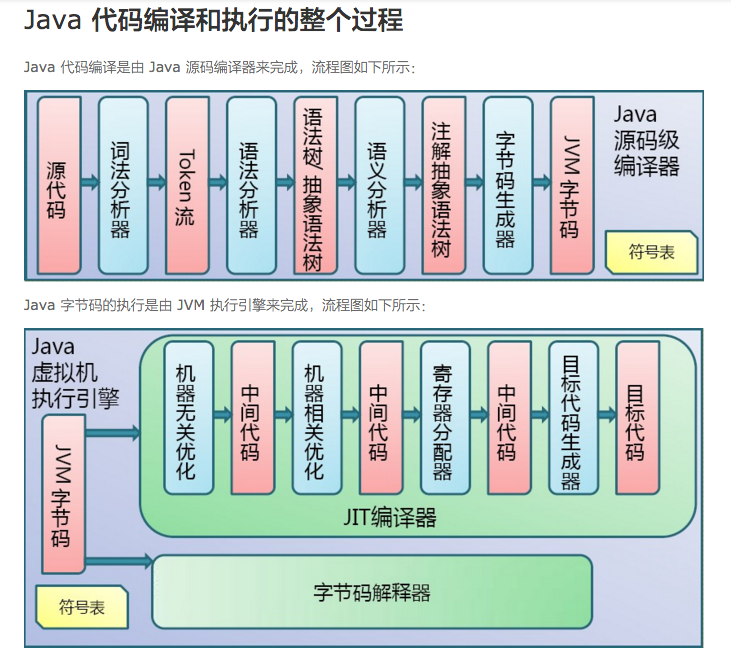

## 内存管理机制

### java程序执行过程
    .java -编译-> .class -> 类加载器

-----------------

## 1.tomcat内存配置
* 案例：由于服务启动后，会有大量的excel文件进行生成，以及大量的定时任务在跑。导致服务抛出堆溢出。

* 解决办法：设置服务JVM参数
> JAVA_OPTS='-Xms【初始化内存大小】 -Xmx【可以使用的最大内存】'
> 最大值设置为可用内存的最大值的80%

## 2.tomcat线程优化
### 1、JDK内存优化
### 2、连接器优化
    `maxThreads`：
    Tomcat使用线程来处理接收的每个请求。这个值表示Tomcat可创建的最大的线程数。默认值150。
    `acceptCount`：
    指定当所有可以使用的处理请求的线程数都被使用时，可以放到处理队列中的请求数，超过这个数的请求将不予处理。默认值10。
    `minSpareThreads`：
    Tomcat初始化时创建的线程数。默认值25。
    `maxSpareThreads`：
    一旦创建的线程超过这个值，Tomcat就会关闭不再需要的socket线程。默认值75。
    `enableLookups`：
    是否反查域名，默认值为true。为了提高处理能力，应设置为false
    connnectionTimeout：
    网络连接超时，默认值60000，单位：毫秒。设置为0表示永不超时，这样设置有隐患的。通常可设置为30000毫秒。
    `maxKeepAliveRequests`：
    保持请求数量，默认值100。
    `bufferSize`：
    输入流缓冲大小，默认值2048 bytes。
    `compression`：
    压缩传输，取值on/off/force，默认值off。
    其中和最大连接数相关的参数为maxThreads和acceptCount。如果要加大并发连接数，应同时加大这两个参数。web server允许的最大连接数还受制于*作系统的内核参数设置，通常Windows是2000个左右，Linux是1000个左右。
### 3.tomcat中如何禁止和允许列目录下的文件
### 4.tomcat中如何禁止和允许主机或IP地址访问

-------------
## JVM性能调优
## 一、JVM内存模型及垃圾收集算法
### 1.根据Java虚拟机规范，JVM将内存划分为：
- New（年轻代)[启动分配堆内存]（-Xmx:3G）
    年轻代用来存放JVM刚分配的Java对象
    - Eden：Eden用来存放JVM刚分配的对象
    - Survivor1
    - Survivro2：两个Survivor空间一样大，当Eden中的对象经过垃圾回收没有被回收掉时，会在两个Survivor之间来回Copy，当满足某个条件，比如Copy次数，就会被Copy到Tenured。显然，Survivor只是增加了对象在年轻代中的逗留时间，增加了被垃圾回收的可能性。
- Tenured（年老代）[启动分配堆内存]（-Xmx:3G）
- 永久代（Perm）[JVM分配内存] （-XX:PermSize -XX:MaxPermSize）

###  2.垃圾回收算法
垃圾回收算法可以分为三类，都基于标记-清除（复制）算法：
- Serial算法（单线程）
- 并行算法
- 并发算法

 #### 网站材料
 [内存管理机制][1]
 
 [1]:  https://www.cnblogs.com/KingIceMou/p/6967129.html