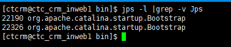
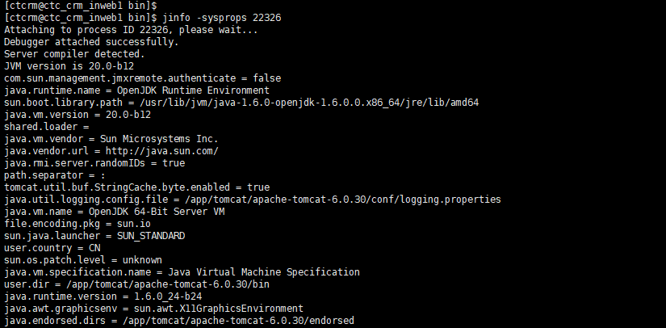

# jvm命令工具
- jps：进程列表
- jinfo：进程配置信息
- jstat：内存配置信息
- jstack：堆栈信息
- jmap：dump堆内存快照
- jhat：和jmap配合使用，分析堆内存快照文件
 

## jps
    -q 只输出LVMID，同进程pid
    -m 输出JVM启动时传给主类main()的参数。
    -l 输出主类全名。如果进程执行的是jar包，则输出包名。
    -v 输出JVM启动时JVM参数。

## jinfo
    -flag name 打印给定name对应的命令行参数值。
    -flag [+|-]name 更改boolean类型的命令行参数值
    -flag name=value 更改name对应的命令行参数值为value。
    -flags 打印传给JVM的命令参数值。
    -sysprops 打印系统属性值。

## 链接
[介绍](https://blog.csdn.net/dream361/article/details/77975381)